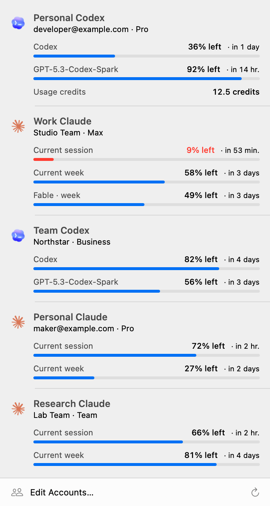
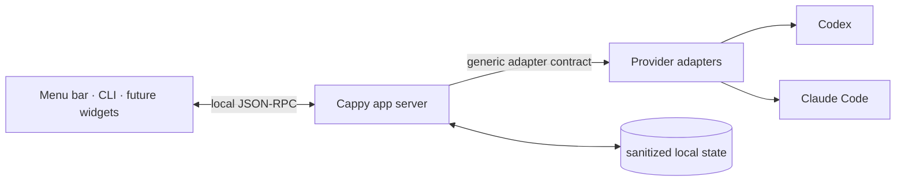

# Cappy

Cappy puts every Codex and Claude limit in one small macOS menu. Keep personal, work, and team accounts visible without repeatedly signing out just to check what is left.

This is an independent project and is not affiliated with, endorsed by, or sponsored by Anthropic or OpenAI. Claude, Claude Code, Codex, and related names are trademarks of their respective owners.

<picture>
  <source media="(prefers-color-scheme: dark)" srcset="docs/preview-dark.png">
  
</picture>

[Watch the polished 10-second launch demo](docs/cappy-launch.mp4).

Cappy is local by design:

- See plan names, reset times, credits, and every quota bucket a provider exposes.
- Drag accounts into your preferred menu order from the built-in account editor.
- Keep managed account sign-ins isolated instead of replacing one global auth file.
- Persist only sanitized profiles and normalized readings—never copied provider tokens or raw usage responses.
- Add providers without changing the app server or UI contract.

Right-click Cappy’s menu-bar item to quit the app.

## How it works



Provider adapters own login, provider-specific discovery, and normalization. The app server only sees the common `AccountSnapshot` and `QuotaMeter` models; every UI consumes that same provider-neutral contract.

The current adapters support:

- Codex account identity, plan name, every dynamic `rateLimitsByLimitId` bucket, secondary windows, usage-credit balances, and reset credits.
- Claude account identity and plan name through the official CLI, plus server-side session, weekly, model, feature, and usage-credit limits for Pro, Max, Team, and Enterprise accounts when returned by Claude. The adapter discovers buckets dynamically through Claude Code's private OAuth usage interface; existing legacy status-line readings can remain as last-known fallback state.

## Install

### Apple silicon download

Download `Cappy-<version>-macos-arm64.zip` from the [latest GitHub release](https://github.com/joetam/cappy/releases/latest), unzip it, and move `Cappy.app` to Applications. Cappy requires macOS 14 or newer.

Preview releases are ad-hoc signed. Until a Developer ID certificate and notarization are configured, macOS may require you to control-click Cappy and choose **Open** the first time.

### Build from source

Requirements: macOS 14 or newer and the Swift 6 command-line toolchain.

```sh
make test
make app
open "build/Cappy.app"
```

Create a reproducible Apple-silicon release archive and checksum:

```sh
./scripts/package-release.sh
```

Pushing a version tag such as `v0.1.0` runs the release workflow and attaches both files to GitHub Releases.

Regenerate the privacy-safe launch demo from the synthetic account preview and original wallpaper:

```sh
make video
```

An npm installer is intentionally out of scope. Cappy is a native Swift menu-bar app, so npm would add a Node dependency without solving macOS signing, notarization, or app installation. A Homebrew cask is the better next distribution option once releases are Developer ID signed.

## Command line

The packaged command-line client is at:

```sh
"build/Cappy.app/Contents/Helpers/quota" status
"build/Cappy.app/Contents/Helpers/quota" refresh
```

Create an isolated account profile and start the vendor-owned browser login:

```sh
"build/Cappy.app/Contents/Helpers/quota" add codex Personal
"build/Cappy.app/Contents/Helpers/quota" add claude Work
```

The new profile is committed only after the provider reports a successful sign-in. Repeating a provider/label pair or authenticating an identity that is already tracked is rejected. Failed and cancelled attempts are discarded.

Remove a tracked profile:

```sh
"build/Cappy.app/Contents/Helpers/quota" remove <profile-id>
```

The menu’s **Edit accounts** screen is the simplest way to reorder accounts. Other clients can save the same ledger order through `profile.reorder`; the CLI exposes it as `quota reorder <profile-id>...`.

For a managed profile this also removes its isolated local vendor credentials. Removing a default profile only stops tracking it; Cappy never deletes `~/.codex` or `~/.claude`, and no action deletes the remote provider account.

## Local data

Cappy stores sanitized profile metadata and snapshots in:

```text
~/Library/Application Support/Cappy/
```

Installations upgraded from the pre-Cappy build continue using `~/Library/Application Support/QuotaBar/` automatically when that legacy directory exists and the new directory does not. This preserves already configured profiles without copying provider credentials.

It does not copy provider tokens into Cappy state. Codex and Claude remain responsible for their own credential stores and browser login flows. The Claude adapter reads the selected profile's OAuth credential only in adapter memory to request usage, and may rotate an expiring token through Claude's OAuth token endpoint. Any rotated credential is written directly back to the same provider-owned Keychain item or credential file; it never crosses the adapter contract.

There is no telemetry, analytics, cloud service, or TCP listener. The app-server and UI communicate through a user-only Unix socket. Account labels, provider identity metadata, plan names, and normalized quota readings stay on the Mac in the directory above. Adapter and vendor subprocesses receive a restricted environment so unrelated credentials exported in a terminal are not forwarded to them.

## Provider compatibility

Provider interfaces can change independently of this project. The Claude adapter uses `claude auth status --json` and Claude Code's private `/api/oauth/usage` interface. That usage interface is not a documented public API and can change without notice. The Codex adapter uses Codex's local app-server account and rate-limit methods. Cappy retains the last good snapshot and marks it stale when an adapter fails, but releases still need compatibility testing against current provider CLIs. Normalizer fixtures and contract/security invariants run in CI without accessing live accounts.

## Publishing

Generated directories (`.build/` and `build/`) and local runtime state are ignored by Git. Run `make test` before publishing. Cappy is available under the [MIT License](LICENSE); provider marks are excluded as described in [third-party notices](THIRD_PARTY_NOTICES.md).

The packaging script uses ad-hoc signing for local builds. Before distributing a prebuilt app, add an app icon and configure Developer ID signing and notarization. Neither is required for contributors building locally from source.

See [ARCHITECTURE.md](ARCHITECTURE.md), [SECURITY.md](SECURITY.md), and [docs/adapter-protocol-v1.md](docs/adapter-protocol-v1.md).
