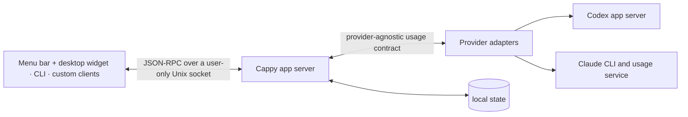

# Cappy

Cappy shows Codex and Claude limits across all your accounts in one macOS menu bar app, with an optional floating desktop widget.

https://github.com/user-attachments/assets/e7f84e2c-2ca9-457c-acc3-164add8eea14

## Why this exists

Cappy answers a simple question: which account can I use next? It shows what's left and when each limit resets, without signing in and out to check.

- Supports two explicit connection types: accounts connected through Cappy, or accounts connected through the existing Claude Code and Codex sign-ins. There is no Cappy account, and Cappy never asks for a password or pasted token. Connections through Cappy use separate CLI profiles.
- No hosted backend, telemetry, or analytics. Usage requests go straight to OpenAI or Anthropic, and cached readings stay on your Mac.
- Cappy is built around a local app server. Provider adapters sit behind it, and every client uses the same API. New providers and interfaces—widgets, TUIs, or anything else—can be added without rewriting the account and quota logic.

## Install

Cappy currently supports Apple silicon on macOS 14 or newer. Install the Codex or Claude Code CLI for each provider you want to track.

### Homebrew

Install Cappy from its Homebrew tap:

```sh
brew install --cask joetam/tap/cappy
```

### Direct download

Download `Cappy-<version>-macos-arm64.dmg` from the [latest release](https://github.com/joetam/cappy/releases/latest), open it, and drag Cappy to Applications.

### First launch

Current builds are ad-hoc signed and not yet notarized. If macOS blocks Cappy the first time:

1. Try to open Cappy, then click **Done** in the warning.
2. Open **System Settings → Privacy & Security**.
3. Scroll to **Security** and click **Open Anyway** next to Cappy.
4. Confirm by clicking **Open**.

macOS saves this exception, so later launches open normally. See [Apple's instructions](https://support.apple.com/102445) for more detail.

### Build from source

Install the Swift 6 command-line toolchain, then run:

```sh
make test
make app
# Produces build/Cappy.app and a versioned DMG under dist/.
```

## Connections

On launch, Cappy checks the accounts currently signed into Codex and Claude Code. When it first discovers a signed-in provider, Cappy asks which connection to use:

- **Connect through Cappy** is recommended. Cappy signs in separately, so the connection always points to that account even if you switch accounts in Claude Code or Codex.
- **Connect through Codex or Claude Code** requires no additional login and uses whichever account is currently signed in to that provider CLI.

The choice is real rather than cosmetic: a provider-CLI connection can be enabled or disabled per provider, and disabled connections are excluded from background refreshes. Cappy and provider-CLI connections can also be combined. When both resolve to the same identity, the quota dashboard shows one account row.

Use **Connections** to see accounts connected through Cappy and through Claude Code or Codex, change which provider CLIs Cappy uses, or add another connection. Failed, cancelled, wrong-account, and duplicate Cappy sign-ins are discarded.

For a connection through Cappy, authentication comes first. After verification, Cappy names the connection with the authenticated email when the provider supplies one, or with a provider-based name otherwise. If that name is already in use, Cappy adds the first available numeric suffix, such as `name@example.com (2)`. Use **Rename connection…** in the connection's menu to choose a different name later.

Choose **Edit** in Connections to arrange all accounts exactly as they appear on the quota screen, regardless of connection type. Choose **Done** to return to the grouped connection settings.

Removing a Cappy connection also removes its isolated local sign-in data. Turning off a provider-CLI connection does not modify that CLI's configuration. Neither action deletes a provider account.

Cappy opens at login by default. Right-click its menu bar icon to turn this off or open **Connections**.

## Desktop widget

Right-click the menu-bar icon and choose **Show Desktop Widget**. It stays above ordinary windows and follows you across Spaces; drag it to move it. Cappy remembers its position and whether it was visible across launches.

Right-click the widget or the menu-bar icon and choose **Return to Menu Bar** to switch back to the anchored popover. You can also opt into the global **Control-Option-C** toggle from the menu-bar icon's context menu. The widget reads the same snapshots as the menu and includes its own refresh and hide controls. It does not start another app server or fetch quota independently.

## How it works



Adapters translate each provider's response into the same data shape. Clients do not need provider-specific code.

## Command line

The command-line client is inside the app bundle:

```sh
CAPPY_CLI="/Applications/Cappy.app/Contents/Helpers/quota"

"$CAPPY_CLI" status
"$CAPPY_CLI" add claude Work
"$CAPPY_CLI" help
```

For a source build, use `build/Cappy.app/Contents/Helpers/quota` instead.

## Local data and credentials

Cappy keeps its account list and cached readings in:

```text
~/Library/Application Support/Cappy/
```

Managed CLI profiles also live under that folder. Cappy only observes the provider-owned defaults in `~/.codex`, `~/.claude`, and the corresponding macOS Keychain entries.

Tokens are not added to Cappy's account list or cache, and the app server and UI never receive them. The Claude adapter reads the selected token to fetch usage and writes any refresh back to the same credential store. The Codex adapter gets usage from the installed Codex app server.

The local app server listens on a user-only Unix socket, not a TCP port. See [SECURITY.md](SECURITY.md) for the full security model.

## Provider support

### General

- Shows the account identity, plan name, and next billing date when available.
- Builds bars from the quota buckets returned by the provider.
- Keeps the last good reading and marks it stale if a refresh fails.

### Codex

- Uses the installed Codex app server under the selected `CODEX_HOME`.
- Reads account-wide and model-specific limits, secondary windows, usage credits, and rate-limit resets when returned.

### Claude

- Uses `claude auth status --json` for account details and Claude Code's private `/api/oauth/usage` endpoint for limits.
- Reads session, weekly, model, feature, spend, and credit limits for Pro, Max, Team, and Enterprise accounts when returned. The private endpoint is undocumented and may change.

Provider interfaces can change. Automated fixtures and contract tests cover the response shapes Cappy currently supports.

Cappy is an independent project and is not affiliated with Anthropic or OpenAI. Claude, Claude Code, Codex, and related names are trademarks of their respective owners.

Cappy is available under the [MIT License](LICENSE). Provider marks are excluded as described in [third-party notices](THIRD_PARTY_NOTICES.md).

More detail: [architecture](ARCHITECTURE.md) · [security](SECURITY.md) · [adapter protocol](docs/adapter-protocol-v1.md)
