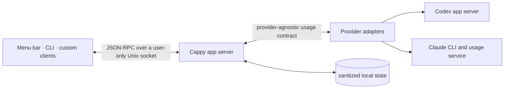

# Cappy

Cappy puts every Codex and Claude limit in one native macOS menu. Track personal, work, and team subscriptions without signing out and back in.

https://github.com/user-attachments/assets/6ad3a65e-f143-43f0-af98-509913b9f9de

- **Uses the sign-ins already on your Mac.** There is no separate Cappy login: authentication stays with the installed Codex and Claude CLIs, and quota comes from provider-owned interfaces. Cappy never asks you to paste a token, stores provider credentials in its state, or replaces your default provider configuration. Additional accounts use isolated provider configuration directories and the provider's own login flow.
- **Private and open source.** Cappy has no cloud service, telemetry, or analytics. Normalized quota snapshots stay on your Mac; nothing is collected by the project. Refresh requests go directly from the local provider adapter to OpenAI or Anthropic.
- **Built for custom clients.** A local app server owns profiles, refreshes, and normalized usage state. The menu app and CLI are thin clients, and the same contract can support a widget, TUI, or another interface.

This is an independent project and is not affiliated with, endorsed by, or sponsored by Anthropic or OpenAI. Claude, Claude Code, Codex, and related names are trademarks of their respective owners.

## How it works



Provider adapters own provider-specific authentication, discovery, and normalization. The app server only sees the common `AccountSnapshot` and `QuotaMeter` models; every client consumes the same provider-agnostic usage contract.

## Install

### Apple silicon

Download `Cappy-<version>-macos-arm64.zip` from the [latest GitHub release](https://github.com/joetam/cappy/releases/latest), unzip it, and move `Cappy.app` to Applications. Cappy requires macOS 14 or newer.

Preview releases are ad-hoc signed. Until a Developer ID certificate and notarization are configured, macOS may require you to control-click Cappy and choose **Open** the first time.

### Build from source

Requirements: macOS 14 or newer and the Swift 6 command-line toolchain.

```sh
make test
make app
open "build/Cappy.app"
```

## Command line

The packaged command-line client is at:

```sh
"build/Cappy.app/Contents/Helpers/quota" status
"build/Cappy.app/Contents/Helpers/quota" refresh
```

Create an isolated account profile and start the provider-owned browser login:

```sh
"build/Cappy.app/Contents/Helpers/quota" add codex Personal
"build/Cappy.app/Contents/Helpers/quota" add claude Work
```

The new profile is committed only after the provider reports a successful sign-in. Repeating a provider/label pair or authenticating an identity that is already tracked is rejected. Failed and cancelled attempts are discarded.

Remove a tracked profile:

```sh
"build/Cappy.app/Contents/Helpers/quota" remove <profile-id>
```

The menu's **Edit Accounts** screen is the simplest way to reorder accounts. Other clients can save the same ledger order through `profile.reorder`; the CLI exposes it as `quota reorder <profile-id>...`.

For a managed profile, removal also removes its isolated local provider credentials. Removing a default profile only stops tracking it; Cappy never deletes `~/.codex` or `~/.claude`, and no action deletes the remote provider account.

Right-click Cappy's menu-bar item to quit the app.

## Local data and authentication

Cappy stores sanitized profile metadata and normalized snapshots in:

```text
~/Library/Application Support/Cappy/
```

Cappy does not copy provider tokens into this state. Codex and Claude remain responsible for their own credential stores and browser login flows. Default profiles use the provider configuration already on the Mac; managed profiles set `CODEX_HOME` or `CLAUDE_CONFIG_DIR` only for their isolated provider process.

The Claude adapter reads the selected profile's OAuth credential only in adapter memory to request usage. If an expiring token is rotated, it is written directly back to the same provider-owned Keychain item or credential file and never crosses the adapter contract. The Codex adapter requests account and quota state from the locally installed Codex app server under the selected profile.

There is no telemetry, analytics service, Cappy backend, or TCP listener. The app server and clients communicate through a user-only Unix socket. Account labels, identity metadata, plan names, and normalized quota readings stay in the local directory above. Adapter and provider subprocesses receive a restricted environment so unrelated credentials exported in a terminal are not forwarded to them.

## Provider compatibility

### General

- Account identity and subscription plan are included when the provider exposes them.
- Quota buckets are discovered dynamically instead of being limited to fixed primary and secondary bars.
- A failed refresh keeps the last good snapshot and marks it stale rather than replacing it with empty data.
- Provider interfaces can change independently, so current CLI compatibility is covered by normalizer fixtures, contract tests, and live release checks.

### Codex

- Uses the installed Codex app server's account and rate-limit methods under the selected `CODEX_HOME`.
- Shows every `rateLimitsByLimitId` bucket, including account-wide Codex limits, model-specific limits such as Spark, secondary windows, usage-credit balances, and reset credits when returned.

### Claude

- Uses `claude auth status --json` for account metadata and the selected provider-owned OAuth credential for usage.
- Shows current-session, weekly, model, feature, spend, and usage-credit limits for Pro, Max, Team, and Enterprise accounts when returned. Model-specific buckets such as Fable are discovered dynamically.
- Calls Claude Code's private `/api/oauth/usage` interface. This is not a documented public API and may change without notice.

Cappy is available under the [MIT License](LICENSE). Provider marks are excluded as described in [third-party notices](THIRD_PARTY_NOTICES.md).

See [ARCHITECTURE.md](ARCHITECTURE.md), [SECURITY.md](SECURITY.md), and [docs/adapter-protocol-v1.md](docs/adapter-protocol-v1.md).
